# Wstęp

Projekt dotyczy klasyfikacji (dron/ptak) obrazów pochodzących z: https://www.kaggle.com/datasets/stealthknight/bird-vs-drone, za pomocą konwolucyjnej sieci neuronowej zaimplementowanej za pomocą PyTorch. Zbiór był domyślnie podzielony na zbiór treningowy, testowy i walidacyjny (~18000, ~1700, 889), dodatkowo w podfolderach train, test, val znajdowały się również folder z plikami tekstowymi które zawierały informacje o położeniu ptaka lub dronu na obrazie za pomocą segmentacji YOLO.

# Balans klas

Zbiór był zbalansowany pod względem liczności obu kategorii przy czym liczba dronów była nieznacząco wyższa w każdym podziale.

```{python}
import pandas as pd

tr = pd.read_csv('Ramka_train.csv', sep=';')
print(f"Ptaki w zbiorze treningowym: {len(tr[tr['Etykiety'] == 'Bird'])}")
print(f"Drony w zbiorze treningowym: {len(tr[tr['Etykiety'] == 'Drone'])}")

v = pd.read_csv('Ramka_val.csv', sep=';')
print(f"Ptaki w zbiorze walidacyjnym: {len(v[v['Etykiety'] == 'Bird'])}")
print(f"Drony w zbiorze walidacyjnym: {len(v[v['Etykiety'] == 'Drone'])}")

t = pd.read_csv('Ramka_test.csv', sep=';')
print(f"Ptaki w zbiorze testowym: {len(t[t['Etykiety'] == 'Bird'])}")
print(f"Drony w zbiorze testowym: {len(t[t['Etykiety'] == 'Drone'])}")
```

# L1
## Różne przestrzenie barw
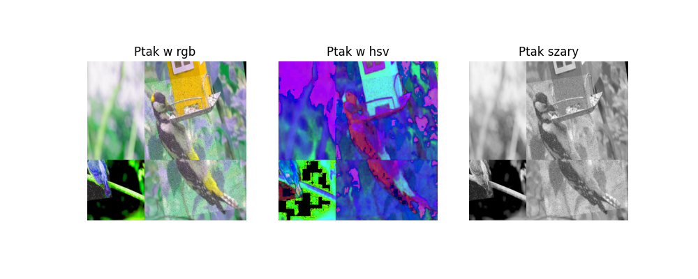

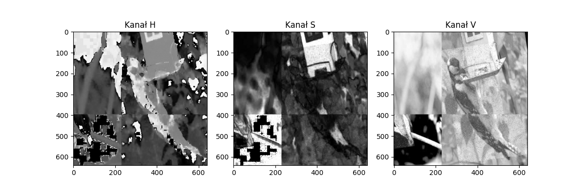

## Kwantyzacja

Zredukowanie 256 poziomów jasności do 64,16,4

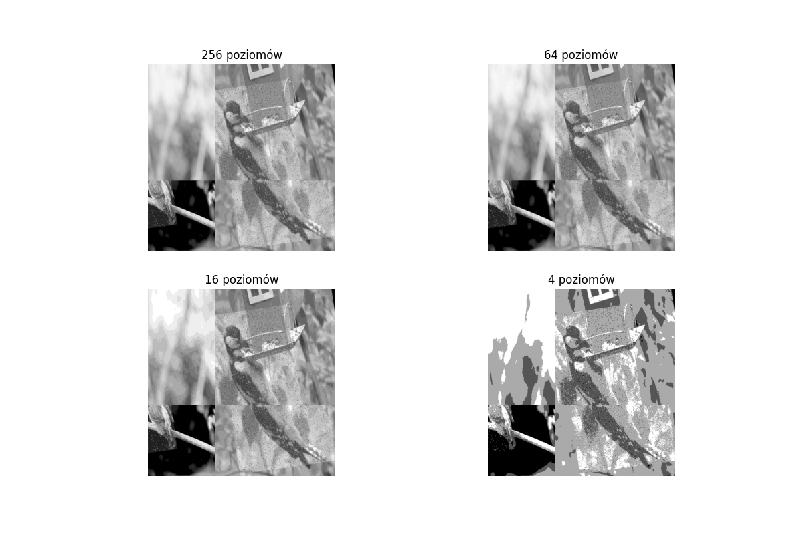

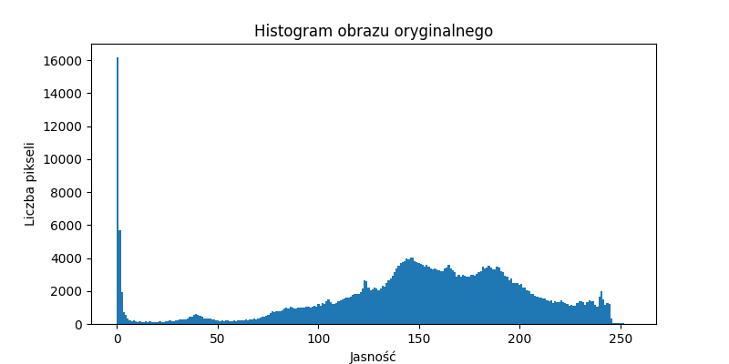

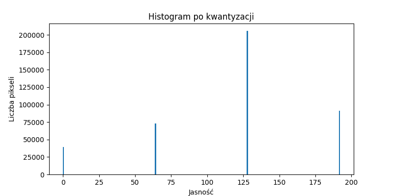

# L2
## Filtry

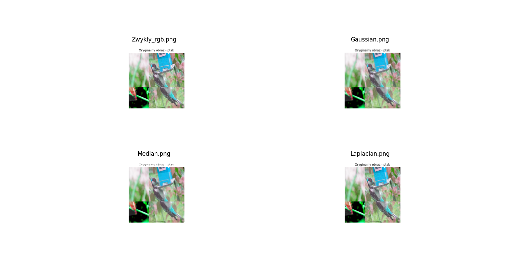

## Transformacje


## Progowanie

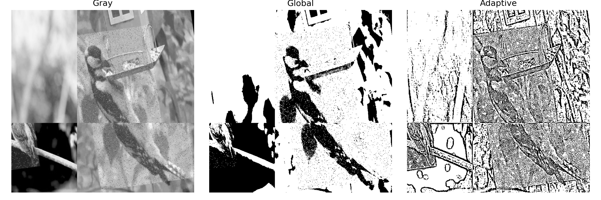

# L3
## Geometria

```{python}
import pandas as pd
p=pd.read_csv('tabela_l3.csv', sep=';')
print(p)
```
## Wizualizacja 

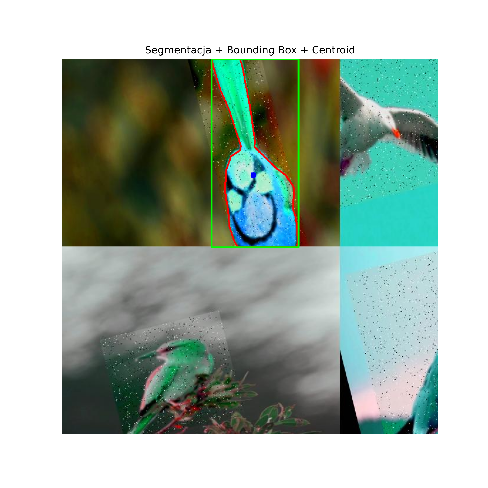

# L5 – Implementacja konwolucyjnej sieci neuronowej

## Przygotowanie danych

Przed rozpoczęciem procesu uczenia obrazy zostały poddane wstępnemu przetwarzaniu. Wszystkie obrazy zostały przeskalowane do rozdzielczości 64 × 64 piksele.

W celu zwiększenia zdolności modelu do generalizacji zastosowano augmentację danych obejmującą:

- losowe odbicie lustrzane,
- losowy obrót w zakresie ±15°,
- normalizację zakresu wartości pikseli do przedziału (0,1).

```python
transform = transforms.Compose([
    transforms.Resize((64,64)),
    transforms.RandomHorizontalFlip(),
    transforms.RandomRotation(15),
    transforms.ToTensor()
])
```

Do uczenia wykorzystano rozmiar próbki (batch size) równy 32.

```python
train_loader = DataLoader(
    train_dataset,
    batch_size=32,
    shuffle=True,
    num_workers=0
)

val_loader = DataLoader(
    val_dataset,
    batch_size=32
)

test_loader = DataLoader(
    test_dataset,
    batch_size=32
)
```

## Architektura sieci CNN

Zaprojektowana sieć neuronowa składała się z dwóch warstw konwolucyjnych przedzielonych warstwami MaxPooling.

Pierwsza warstwa konwolucyjna przyjmowała trzy kanały wejściowe RGB i wykorzystywała 32 filtry o rozmiarze 3 × 3. Następnie zastosowano funkcję aktywacji ReLU oraz warstwę MaxPooling zmniejszającą rozmiar map cech.

Druga warstwa konwolucyjna przyjmowała 32 mapy cech jako wejście i wykorzystywała 64 filtry o rozmiarze 3 × 3. Po funkcji aktywacji ReLU ponownie zastosowano warstwę MaxPooling.

```python
class CNN(nn.Module):

    def __init__(self):

        super().__init__()

        self.conv = nn.Sequential(

            nn.Conv2d(3,32,3),
            nn.ReLU(),
            nn.MaxPool2d(2),

            nn.Conv2d(32,64,3),
            nn.ReLU(),
            nn.MaxPool2d(2)
        )
```

W części klasyfikacyjnej wykorzystano warstwę Adaptive Average Pooling, która sprowadzała każdą z 64 map cech do pojedynczej wartości średniej. Następnie dane były spłaszczane do jednowymiarowego wektora i przekazywane do warstw gęstych.

W celu ograniczenia zjawiska przeuczenia zastosowano warstwę Dropout o współczynniku 0,3.

```python
self.fc = nn.Sequential(

    nn.AdaptiveAvgPool2d((1, 1)),
    nn.Flatten(),
    nn.Dropout(0.3),

    nn.Linear(64, 32),
    nn.ReLU(),

    nn.Linear(32, 2)
)
```

Przepływ danych przez sieć był definiowany przez funkcję `forward()`, która najpierw przekazywała obraz przez część konwolucyjną, a następnie przez część klasyfikacyjną.

```python
def forward(self, x):

    x = self.conv(x)
    x = self.fc(x)

    return x
```

## Ocena modelu

Jako miary jakości klasyfikacji wykorzystano:

- Accuracy,
- Precision,
- Recall,
- F1-score.

Dodatkowo przedstawiono macierz pomyłek, krzywą ROC oraz wykresy zmian funkcji straty i dokładności na zbiorach treningowym i walidacyjnym.

W celu lepszej interpretacji działania modelu zaprezentowano również przykłady błędnie sklasyfikowanych obrazów.

## Metryki podczas uczenia

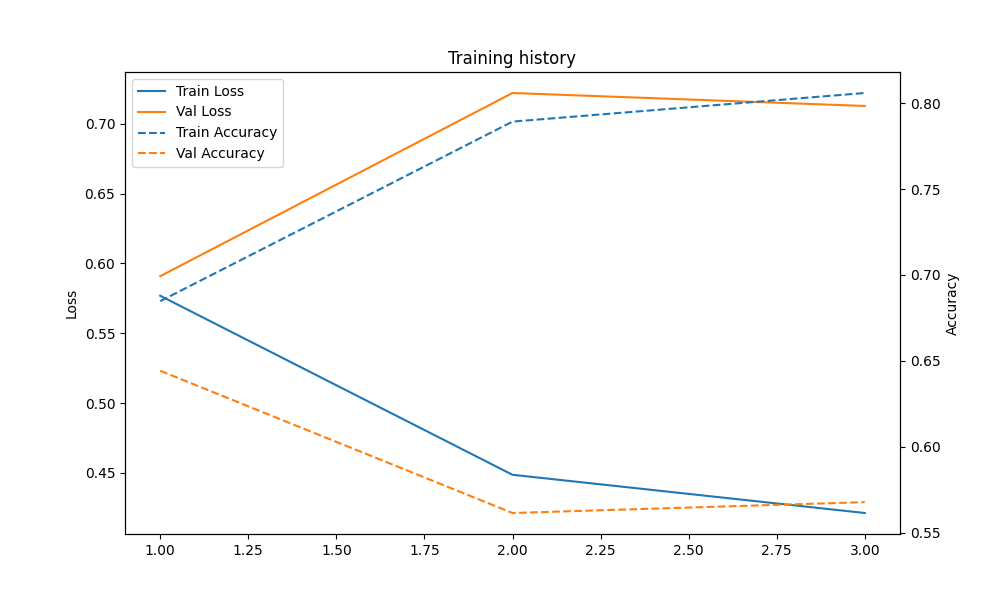

## Metryki końcowe

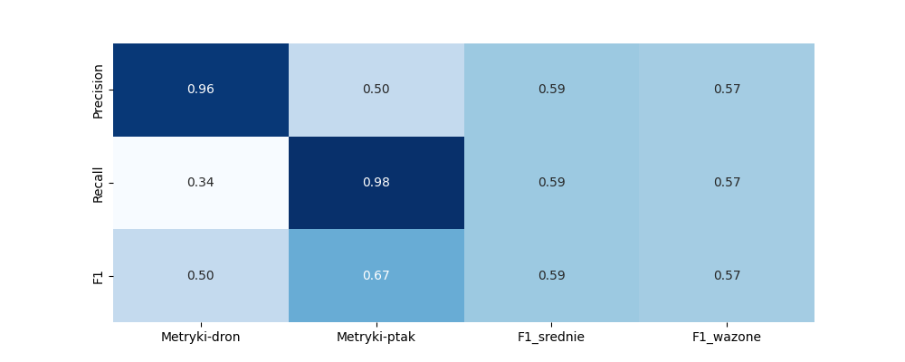

## Macierz pomyłek

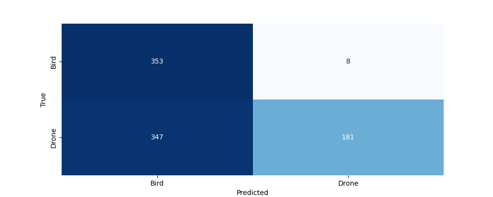

## Krzywa ROC

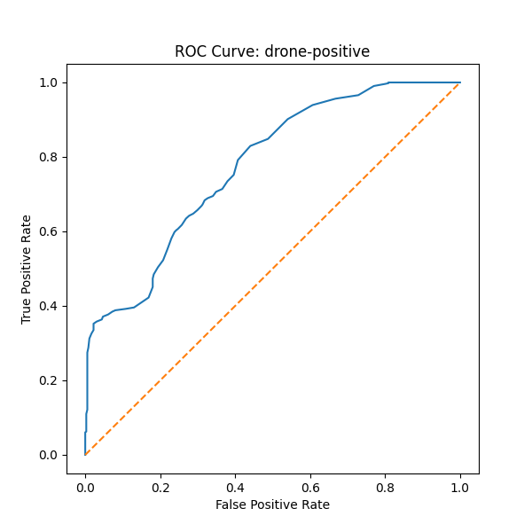

## Przykłady błędnych klasyfikacji

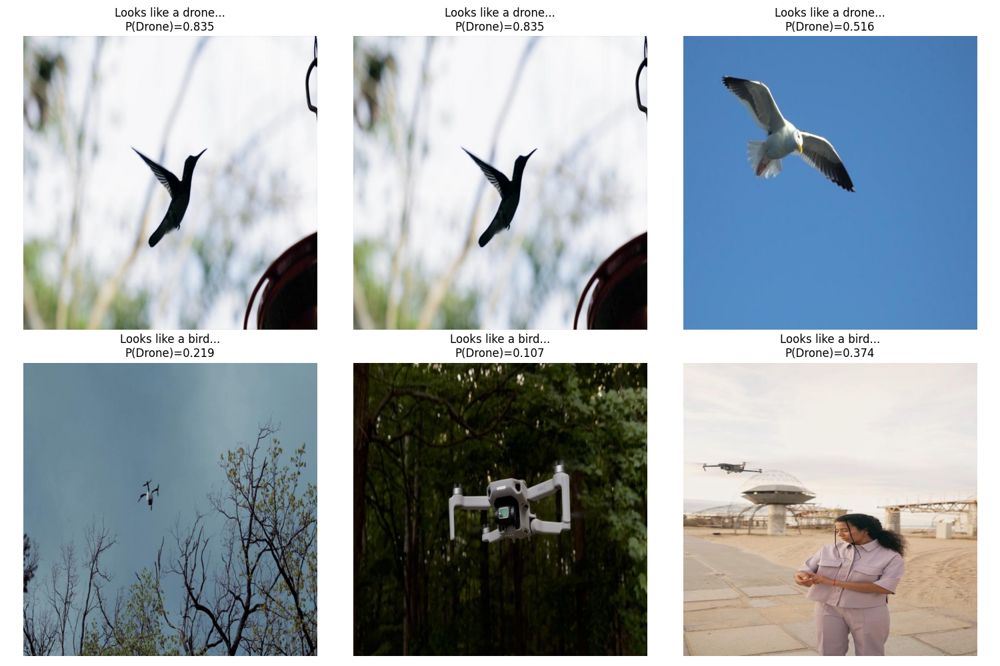

